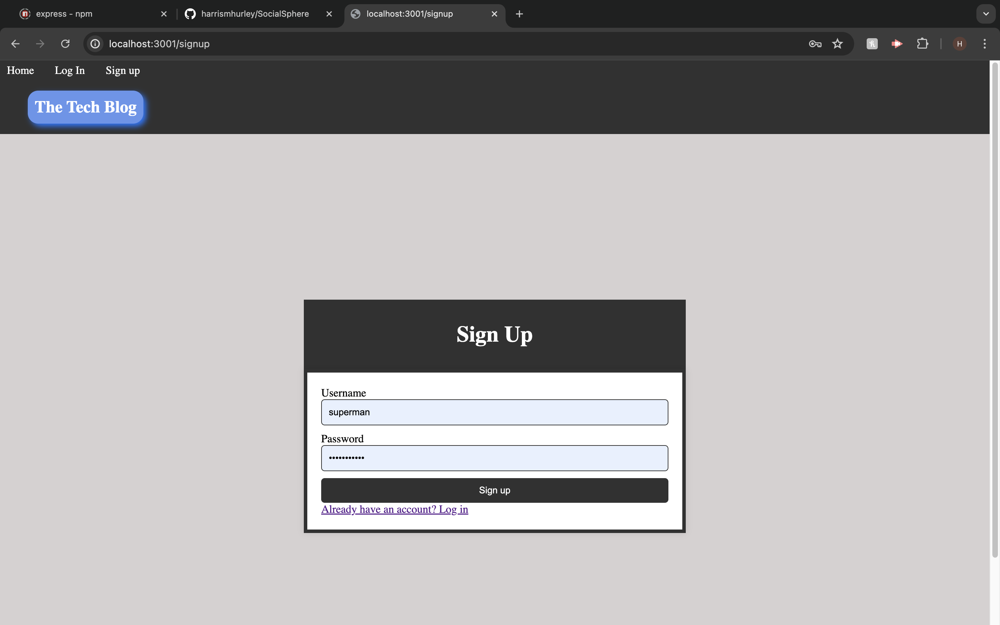
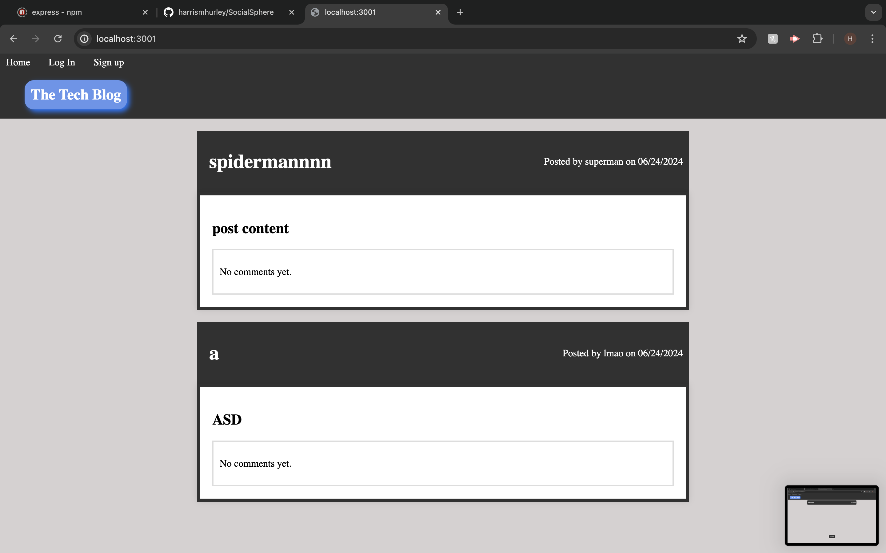
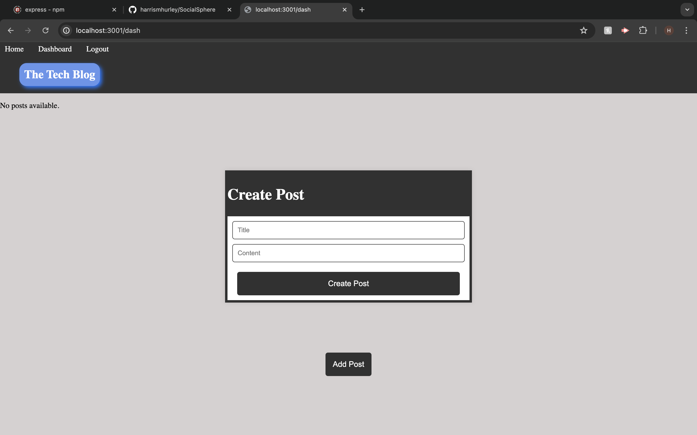
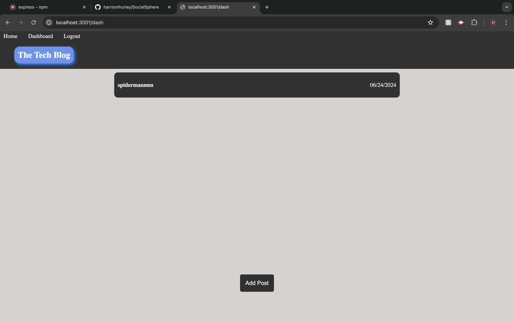

# SocialSphere

    

## Description

The SocialSphere project is a full-stack web application designed to create a dynamic and interactive blogging platform. It allows users to create an account, log in securely, and share posts with the community. Users can view posts created by others, add comments, update their own posts, and delete them as needed. The application features robust authentication using bcrypt for password hashing and secure session management with Express.js and Sequelize. It leverages technologies like Handlebars for templating, ensuring a responsive and intuitive user interface. SocialSphere aims to provide a seamless blogging experience, promoting user engagement through streamlined interactions and dynamic content management.

## Deployed Application URL

[Social Sphere](https://socialsphere-8syw.onrender.com)

## Table of Contents
* [Installation](#installation)
* [Usage](#usage)
* [Credits](#credits)
* [Features](#features)
* [Dependencies](#dependencies)
* [Screenshots](#screenshots)
* [How to Contribute](#how-to-contribute)
* [Tests](#tests)
* [License](#license)

## Installation
To install this application, follow these steps:

1. Clone the repository to your local machine using the command: `git@github.com:harrismhurley/SocialSphere.git`
2. Navigate into the project directory:
3. Install dependencies using npm: 'npm i'
4. Create the PostgreSQL database specified in your `.env` file.

## Usage
To use this application, follow these steps:

1. Start the application: `node server.js`
2. Open your web browser and navigate to `http://localhost:3000`.
3. Register a new user account or log in with existing credentials.
4. Explore existing posts, add new posts, update or delete posts as needed.
5. Engage with posts by adding comments.

## Credits

N/A

## Features

- User Authentication: Secure user registration and login functionality.
- Post Management: Create, update, and delete posts with ease.
- Comment System: Engage with posts by adding comments.
- Session Management: Manage user sessions securely with Express.js and Sequelize.
- Responsive Design: Ensures optimal viewing experience across devices.
- Dependency Management: Utilizes npm for managing project dependencies.
- Database Integration: Seamless integration with PostgreSQL database using Sequelize ORM.
- Error Handling: Robust error handling to ensure smooth user experience.
- Password Hashing: Utilizes bcrypt for secure password hashing.
- Dynamic Templating: Implements Handlebars for dynamic HTML templating.

## Dependencies

- bcrypt 5.1.1
- connect-session-sequelize 7.1.7
- dotenv 16.4.5
- express 4.19.2
- express-handlebars 7.1.3
- express-session 1.18.0
- path 0.12.7
- pg 8.12.0
- sequelize 6.37.3

## Screenshots

## How to Contribute
If you would like to contribute you can contact me [Via Email](mailto:harrismhurley@icloud.com?subject=[GitHub]%20Dev%20Connect) or visit [github](https://github.com/harrismhurley).

## Tests

N/A

## License 
This project is licensed under the [MIT](https://opensource.org/licenses/MIT) license.